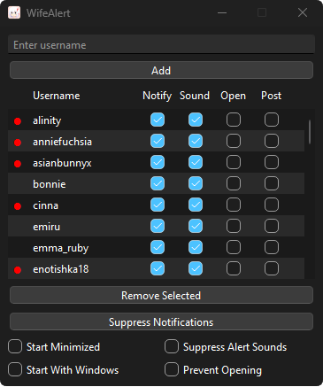

# WifeAlert
A customizable Twitch notification tool.




## Features

- 🔔 **Desktop Notifications**: Get instant alerts when your favorite streamers go live
- 🎵 **Custom Sound Alerts**: Set unique notification sounds for each streamer
- 🎮 **Auto-Open Streams**: Automatically open streams when they go live
- 🛡️ **Mod View Support**: Quick access to moderator dashboard for authorized users
- 🔄 **Auto-Start with Windows**: Option to launch automatically on system startup
- 🎨 **User-Friendly Interface**: Clean, intuitive design with system tray support
- 💬 **Chat Integration**: Send automated chat messages when streams start

## Installation

### Installation Methods

All methods provide identical features and functionality. Choose your preferred method:

#### Method 1: Using the Installer
1. Download `WifeAlert_Setup.exe` from the [Releases](https://github.com/nazarein/wifealert/releases) page
2. Run the installer
3. Follow the installation wizard
4. Launch WifeAlert from your Start Menu or Desktop

#### Method 2: Standalone Executable
1. Download `WifeAlert.exe` from the [Releases](https://github.com/nazarein/wifealert/releases) page
2. Place the file wherever you want
3. Double-click to run

#### Method 3: Running from Source
You'll need Git and Python 3.8 or higher installed.

```bash
# Clone the repository
git clone https://github.com/nazarein/wifealert.git
cd wifealert

# Create and activate virtual environment
python -m venv venv
.\venv\Scripts\activate

# Install dependencies
pip install -r requirements.txt

# Run the application
python main.py
```

**System Requirements:**
- Windows 10 or higher
- 100MB free disk space
- Internet connection
- Python 3.8+ (only for running from source)
- Git (only for running from source)

**Note:** Settings are stored in `%APPDATA%\WifeAlert\` regardless of installation method.

## Usage

### Basic Setup

1. Launch WifeAlert
2. Enter Twitch usernames to monitor in the input field
3. Click "Add" to add them to your monitoring list

### Notification Options

For each streamer, you can configure:
- Desktop notifications
- Sound alerts 
- Auto-open stream 
- Chat messages

### Chat Features Setup(OPTIONAL)

To use chat message features:

1. Click the "Post" checkbox next to a streamer
2. Shift+Click the checkbox to configure messages
3. Get your chat OAuth token from [Twitch Token Generator](https://twitchtokengenerator.com)
4. Enter your Twitch username and OAuth token
5. Configure your desired chat messages and timing

### Additional Settings

- **Start With Windows**: Launch automatically on system startup
- **Start Minimized**: Launch WifeAlert in system tray
- **Suppress Alert Sounds**: Temporarily disable all sound notifications
- **Prevent Opening**: Temporarily disable auto-opening streams

## Security

WifeAlert takes security seriously:
- Chat OAuth tokens are encrypted using industry-standard encryption
- No data is sent to external servers except Twitch
- All settings are stored locally on your machine


## License

This project is licensed under the MIT License - see the [LICENSE](LICENSE) file for details.

---
